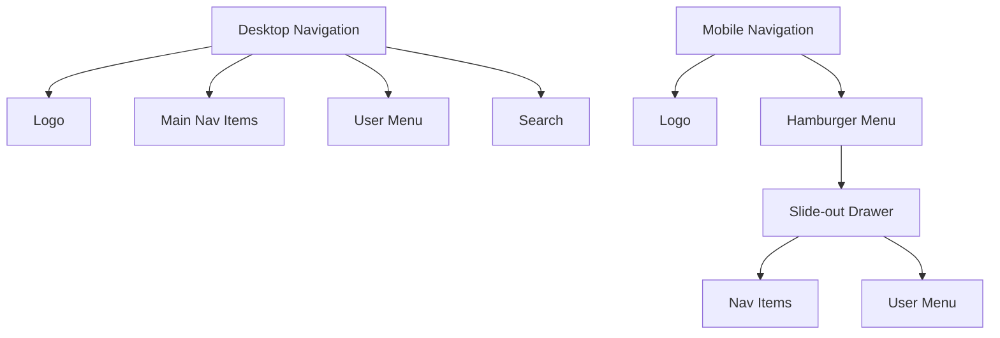
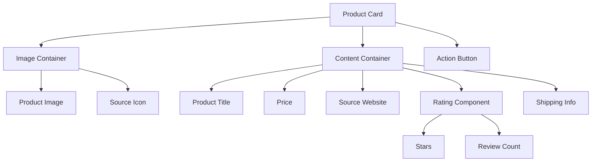
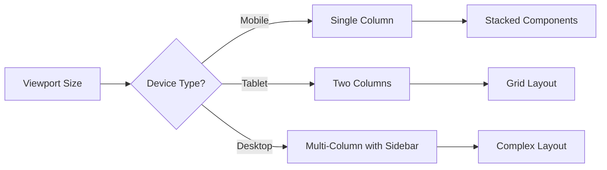

# Frontend Enhancement Design Document

## Overview

This design document outlines the approach for enhancing the frontend of the BuyRoll application. The goal is to create a modern, responsive, and accessible user interface that provides an excellent user experience across all devices while maintaining the brand identity. The design will focus on improving navigation, implementing responsive layouts, modernizing UI components, ensuring accessibility, enhancing product browsing capabilities, improving forms, and establishing a consistent visual identity.

## Architecture

### Frontend Architecture

The frontend enhancement will follow a component-based architecture using modern frontend practices. We'll implement:

1. **Component Library**: A reusable set of UI components that follow consistent design patterns
2. **Responsive Grid System**: A flexible grid system that adapts to different screen sizes
3. **State Management**: Clear patterns for managing UI state and user interactions
4. **Asset Management**: Optimized handling of images, fonts, and other assets

### Technology Stack

The frontend will be built using:

- **HTML5**: For semantic markup
- **CSS3**: For styling, with a focus on Flexbox and CSS Grid for layouts
- **JavaScript**: For interactivity and dynamic content
- **Tailwind CSS**: Already in use, will be leveraged for utility-based styling
- **Alpine.js**: Already in use, will be enhanced for reactive UI components
- **Flask Templates**: Integration with the existing Flask backend

## Components and Interfaces

### Core UI Components

1. **Navigation System**
   - Responsive navbar with mobile hamburger menu
   - Active state indicators
   - User-specific navigation options
   - Dropdown menus for nested navigation

2. **Card Components**
   - Product cards with consistent styling
   - Information hierarchy within cards
   - Interactive states (hover, focus, active)
   - Loading skeleton states

3. **Form Components**
   - Input fields with validation states
   - Custom select dropdowns
   - Checkboxes and radio buttons
   - Form section grouping
   - Progress indicators for multi-step forms

4. **Button System**
   - Primary, secondary, and tertiary button styles
   - Icon buttons
   - Button states (default, hover, active, disabled)
   - Loading states

5. **Modal and Dialog System**
   - Confirmation dialogs
   - Information modals
   - Form modals
   - Accessible focus management

6. **Notification System**
   - Success messages
   - Error notifications
   - Warning alerts
   - Toast notifications

### Layout Components

1. **Grid System**
   - 12-column responsive grid
   - Breakpoints for different device sizes
   - Container components

2. **Product Listing Layouts**
   - Grid view
   - List view
   - Filtering sidebar
   - Sorting controls

3. **Page Templates**
   - Home page layout
   - Product detail layout
   - Account management layouts
   - Checkout flow layouts

## Data Models

### UI State Models

1. **Navigation State**
   ```javascript
   {
     activeSection: String,
     isMenuOpen: Boolean,
     userMenuOpen: Boolean,
     isLoggedIn: Boolean
   }
   ```

2. **Product Filter State**
   ```javascript
   {
     view: 'grid' | 'list',
     sortBy: String,
     filters: {
       category: String[],
       price: { min: Number, max: Number },
       rating: Number,
       // Other filter attributes
     },
     isLoading: Boolean
   }
   ```

3. **Form State**
   ```javascript
   {
     currentStep: Number,
     totalSteps: Number,
     formData: Object,
     validationErrors: Object,
     isSubmitting: Boolean,
     submitSuccess: Boolean,
     submitError: String
   }
   ```

### Component Props Models

1. **Product Card Props**
   ```javascript
   {
     id: String,
     title: String,
     description: String,
     price: Number,
     currency: String,
     imageUrl: String,
     rating: Number,
     reviewCount: Number,
     source: String,
     shippingInfo: String
   }
   ```

2. **Form Input Props**
   ```javascript
   {
     id: String,
     name: String,
     type: String,
     value: String,
     placeholder: String,
     label: String,
     required: Boolean,
     validationRules: Object,
     errorMessage: String,
     isValid: Boolean
   }
   ```

## Design System

### Color Palette

The color palette will be based on the existing BuyRoll brand colors:

- **Primary Colors**
  - Green-900: #55970f (Dark green for primary actions)
  - Green-800: #6abe11 (Light green for gradients and accents)
  - White: #FFFFFF (Background and text on dark surfaces)
  - Black: #000000 (Text and dark surfaces)

- **Secondary Colors**
  - Green-300: #A3E635 (Light green for backgrounds and accents)
  - Green-750: #8DC63F (Medium green for borders and secondary elements)
  - Yellow-500: #EAB308 (For ratings and highlights)
  - Gray-400: #9CA3AF (For secondary text and disabled states)
  - Gray-500: #6B7280 (For tertiary text and subtle elements)

- **Functional Colors**
  - Success: #10B981 (Green for success states)
  - Error: #EF4444 (Red for error states)
  - Warning: #F59E0B (Amber for warning states)
  - Info: #3B82F6 (Blue for information states)

### Typography

- **Font Families**
  - Primary: System font stack for optimal performance
  - Headings: Same as primary for consistency

- **Font Sizes**
  - Base: 16px (1rem)
  - Scale: 1.25 ratio for a harmonious type scale
  - Responsive adjustments at breakpoints

- **Font Weights**
  - Regular: 400
  - Medium: 500
  - Semibold: 600
  - Bold: 700
  - Black: 900 (for specific emphasis)

### Spacing System

- Base unit: 4px (0.25rem)
- Spacing scale: 0.25rem, 0.5rem, 0.75rem, 1rem, 1.5rem, 2rem, 3rem, 4rem, 6rem, 8rem

### Breakpoints

- Mobile: < 640px
- Tablet: 640px - 1023px
- Desktop: ≥ 1024px
- Large Desktop: ≥ 1280px
- Extra Large: ≥ 1536px

### Iconography

- Consistent use of Font Awesome icons (already in use)
- Custom SVG icons for brand-specific elements
- Icon sizing system aligned with typography scale

## Responsive Design Strategy

### Mobile-First Approach

The design will follow a mobile-first approach, starting with the mobile layout and progressively enhancing for larger screens.

### Key Responsive Patterns

1. **Navigation**
   - Mobile: Hamburger menu with slide-out drawer
   - Tablet: Condensed horizontal navigation
   - Desktop: Full horizontal navigation with dropdowns

2. **Product Listings**
   - Mobile: Single column, full-width cards
   - Tablet: 2-column grid
   - Desktop: 3-4 column grid with filtering sidebar

3. **Forms**
   - Mobile: Stacked, full-width inputs
   - Tablet/Desktop: Multi-column where appropriate

### Responsive Images

- Use of `srcset` and `sizes` attributes for responsive images
- Image optimization for different viewport sizes
- Lazy loading for improved performance

## Accessibility Implementation

### WCAG Compliance

The design will aim for WCAG 2.1 AA compliance, including:

- Sufficient color contrast (minimum 4.5:1 for normal text)
- Keyboard navigability for all interactive elements
- Screen reader compatibility with appropriate ARIA attributes
- Focus management for interactive elements

### Specific Accessibility Features

1. **Skip Links**: Allow keyboard users to skip to main content
2. **Focus Indicators**: Visible focus states for keyboard navigation
3. **ARIA Landmarks**: Proper semantic structure with landmarks
4. **Form Accessibility**: Labels, error messages, and instructions
5. **Alternative Text**: For all informative images
6. **Keyboard Shortcuts**: For common actions

## Error Handling

### Form Validation

- Real-time validation feedback
- Clear error messages with instructions for correction
- Visual indicators for invalid fields
- Accessible error announcements

### System Errors

- User-friendly error messages
- Fallback UI for failed data loading
- Retry mechanisms for transient errors

## Testing Strategy

### Cross-Browser Testing

- Testing across major browsers (Chrome, Firefox, Safari, Edge)
- Testing on different operating systems (Windows, macOS, iOS, Android)

### Responsive Testing

- Testing at all defined breakpoints
- Testing on actual devices (not just emulators)
- Testing orientation changes on mobile devices

### Accessibility Testing

- Automated testing with tools like Axe
- Manual testing with screen readers
- Keyboard navigation testing
- Color contrast verification

### Performance Testing

- Lighthouse performance audits
- Page load time optimization
- First Contentful Paint and Largest Contentful Paint metrics
- Interaction to Next Paint for responsiveness

## Implementation Considerations

### Progressive Enhancement

The implementation will follow progressive enhancement principles:

1. Start with semantic HTML for core functionality
2. Add CSS for styling and layout
3. Add JavaScript for enhanced interactivity
4. Ensure core functionality works without JavaScript

### Performance Optimization

- Minimize CSS and JavaScript
- Optimize and compress images
- Implement lazy loading for off-screen content
- Use appropriate caching strategies

### Maintainability

- Consistent naming conventions
- Component documentation
- Code comments for complex logic
- Separation of concerns

## Design Mockups

### Navigation System



### Product Card Design



### Responsive Layout Flow



## Future Considerations

1. **Theme Support**: Potential for light/dark mode toggle
2. **Animation Library**: More advanced animations for enhanced UX
3. **Internationalization**: Support for multiple languages
4. **Offline Support**: Progressive Web App capabilities
5. **AR Features**: Product visualization in augmented reality