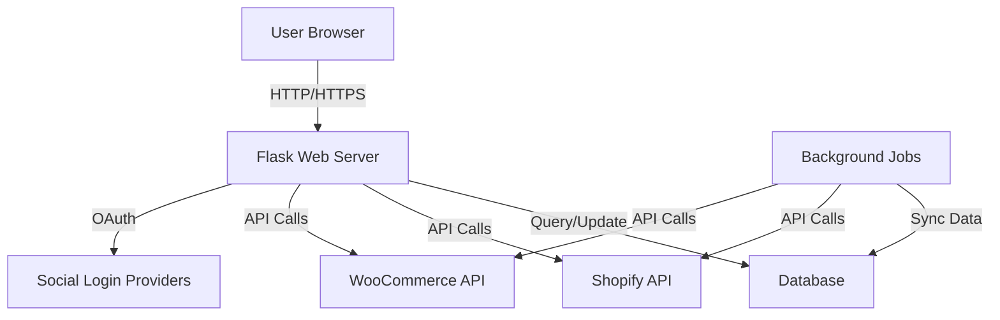
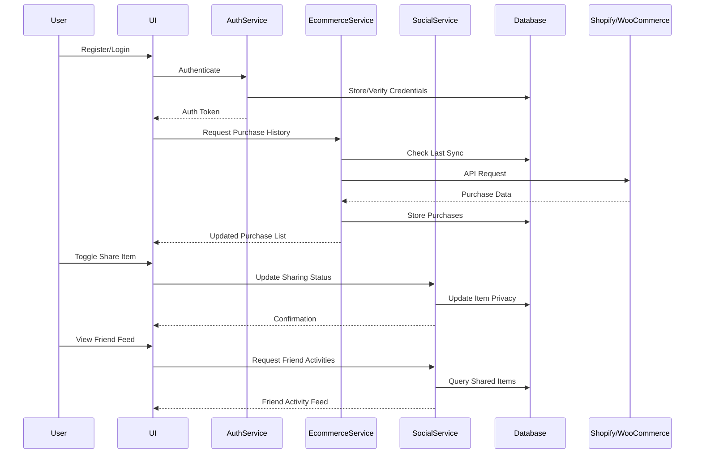
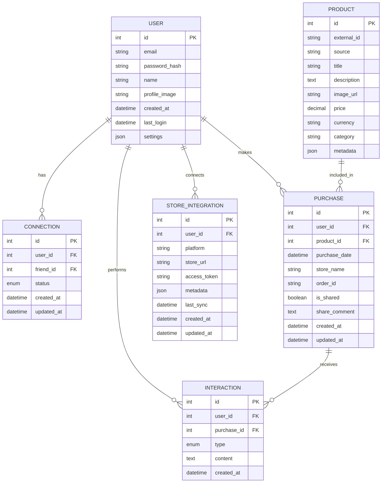
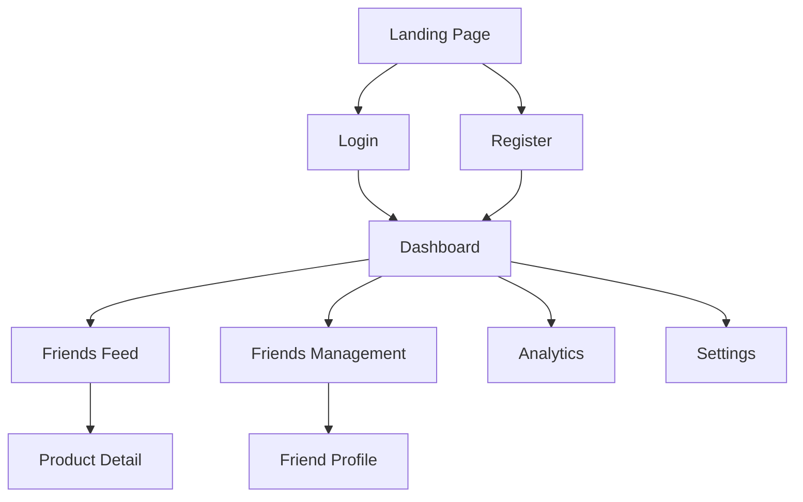
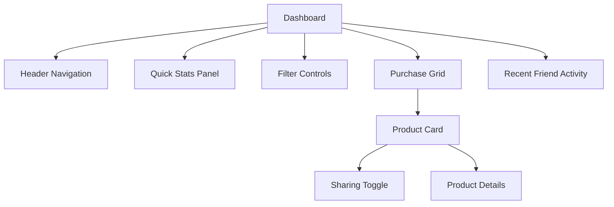
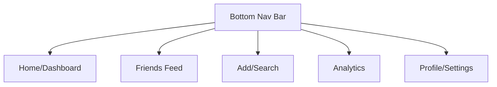

# Social E-commerce Platform Design Document

## Overview

BuyRoll is a social e-commerce platform that connects users' shopping experiences across different online stores and allows them to share selected purchases with friends. The platform integrates with e-commerce systems like Shopify and WooCommerce to automatically import purchase history based on email matching. Users can view their complete purchase history in a unified dashboard, choose which items to share socially, connect with friends, view friends' shared purchases, and analyze their own shopping patterns through intuitive visualizations.

This design document outlines the architecture, components, data models, and user interfaces required to implement the BuyRoll platform according to the requirements.

## Architecture

### System Architecture

The BuyRoll platform will follow a modern web application architecture with these key components:

1. **Frontend Layer**
   - Responsive web interface built with HTML5, CSS3 (Tailwind), JavaScript
   - Alpine.js for reactive UI components
   - Chart.js for analytics visualizations

2. **Backend Layer**
   - Flask web framework for server-side logic
   - RESTful API endpoints for frontend communication
   - Authentication and session management
   - Background tasks for e-commerce synchronization

3. **Data Layer**
   - SQLite database for development (can be migrated to PostgreSQL for production)
   - Efficient data models for users, products, purchases, and social connections
   - Caching layer for performance optimization

4. **Integration Layer**
   - Shopify API integration
   - WooCommerce API integration
   - OAuth for social login providers

### High-Level Architecture Diagram



## Components and Interfaces

### Core Components

1. **Authentication System**
   - Registration and login forms
   - Social login integration (Google, Facebook, Amazon)
   - Session management
   - Password reset functionality

2. **E-commerce Integration Service**
   - API clients for Shopify and WooCommerce
   - Purchase data synchronization
   - Product metadata extraction
   - Error handling and retry logic

3. **Social Graph Manager**
   - Friend request handling
   - Connection management
   - Privacy controls
   - Friend search functionality

4. **Purchase Sharing System**
   - Sharing toggle controls
   - Privacy management
   - Activity feed generation
   - Notification system

5. **Analytics Engine**
   - Purchase data aggregation
   - Category classification
   - Time-series analysis
   - Visualization generation

6. **User Interface Components**
   - Responsive navigation system
   - Product card components
   - Social feed renderer
   - Dashboard layout manager
   - Chart and graph components

### Component Interactions



## Data Models

### Core Data Models

1. **User Model**
```python
class User:
    id: Integer (Primary Key)
    email: String (Unique)
    password_hash: String
    name: String
    profile_image: String
    created_at: DateTime
    last_login: DateTime
    settings: JSON
```

2. **Connection Model**
```python
class Connection:
    id: Integer (Primary Key)
    user_id: Integer (Foreign Key -> User.id)
    friend_id: Integer (Foreign Key -> User.id)
    status: Enum ('pending', 'accepted', 'rejected', 'blocked')
    created_at: DateTime
    updated_at: DateTime
```

3. **Product Model**
```python
class Product:
    id: Integer (Primary Key)
    external_id: String
    source: String (e.g., 'shopify', 'woocommerce')
    title: String
    description: Text
    image_url: String
    price: Decimal
    currency: String
    category: String
    metadata: JSON
```

4. **Purchase Model**
```python
class Purchase:
    id: Integer (Primary Key)
    user_id: Integer (Foreign Key -> User.id)
    product_id: Integer (Foreign Key -> Product.id)
    purchase_date: DateTime
    store_name: String
    order_id: String
    is_shared: Boolean (default: False)
    share_comment: Text
    created_at: DateTime
    updated_at: DateTime
```

5. **Interaction Model**
```python
class Interaction:
    id: Integer (Primary Key)
    user_id: Integer (Foreign Key -> User.id)
    purchase_id: Integer (Foreign Key -> Purchase.id)
    type: Enum ('like', 'comment', 'save')
    content: Text
    created_at: DateTime
```

6. **Store Integration Model**
```python
class StoreIntegration:
    id: Integer (Primary Key)
    user_id: Integer (Foreign Key -> User.id)
    platform: String (e.g., 'shopify', 'woocommerce')
    store_url: String
    access_token: String (encrypted)
    metadata: JSON
    last_sync: DateTime
    created_at: DateTime
    updated_at: DateTime
```

### Database Schema Diagram



## User Interface Design

### Key Screens and Flows

1. **Authentication Flow**
   - Landing page with value proposition
   - Registration form
   - Login form
   - Social login options
   - Password reset flow

2. **Dashboard**
   - Header with navigation and user menu
   - Purchase history grid/list with sharing toggles
   - Filtering and sorting controls
   - Quick stats summary
   - Recent friend activity preview

3. **Friends Feed**
   - Chronological feed of friends' shared purchases
   - Interaction controls (like, comment, save)
   - Infinite scroll pagination
   - Filter by friend or category

4. **Friends Management**
   - Friend search
   - Friend requests (sent/received)
   - Current friends list
   - Friend removal option

5. **Analytics Dashboard**
   - Spending by category chart
   - Monthly spending trend
   - Top stores visualization
   - Time period selector
   - Detailed breakdown tables

6. **Settings**
   - Profile information management
   - Password change
   - Privacy settings
   - E-commerce account connections
   - Notification preferences

### UI Mockups

#### Navigation Structure



#### Dashboard Layout



#### Mobile Navigation Flow



## Design System

### Color Palette

- **Primary Colors**
  - Green-900: #55970f (Dark green for primary actions)
  - Green-800: #6abe11 (Light green for gradients and accents)
  - White: #FFFFFF (Background and text on dark surfaces)
  - Black: #000000 (Text and dark surfaces)

- **Secondary Colors**
  - Green-300: #A3E635 (Light green for backgrounds and accents)
  - Green-750: #8DC63F (Medium green for borders and secondary elements)
  - Yellow-500: #EAB308 (For ratings and highlights)
  - Gray-400: #9CA3AF (For secondary text and disabled states)
  - Gray-500: #6B7280 (For tertiary text and subtle elements)

- **Functional Colors**
  - Success: #10B981 (Green for success states)
  - Error: #EF4444 (Red for error states)
  - Warning: #F59E0B (Amber for warning states)
  - Info: #3B82F6 (Blue for information states)

### Typography

- **Font Families**
  - Primary: System font stack for optimal performance
  - Headings: Same as primary for consistency

- **Font Sizes**
  - Base: 16px (1rem)
  - Scale: 1.25 ratio for a harmonious type scale
  - Responsive adjustments at breakpoints

- **Font Weights**
  - Regular: 400
  - Medium: 500
  - Semibold: 600
  - Bold: 700
  - Black: 900 (for specific emphasis)

### Component Design

1. **Product Card**
   - Consistent sizing and padding
   - Product image with aspect ratio constraint
   - Clear typography hierarchy
   - Price and store prominently displayed
   - Sharing toggle with clear states
   - Hover and focus states

2. **Navigation**
   - Desktop: Horizontal navigation with dropdowns
   - Mobile: Bottom navigation bar with icons and labels
   - Active state indicators
   - Consistent spacing and alignment

3. **Buttons**
   - Primary: Green gradient with white text
   - Secondary: White with green border
   - Tertiary: Text-only with hover state
   - Icon buttons with tooltips
   - Consistent padding and border radius

4. **Forms**
   - Floating labels for better UX
   - Clear validation states
   - Consistent input styling
   - Helpful error messages
   - Logical tab order

5. **Charts and Visualizations**
   - Consistent color coding
   - Clear legends and labels
   - Interactive tooltips
   - Responsive sizing
   - Accessible alternatives for screen readers

## API Design

### Authentication Endpoints

```
POST /api/auth/register
POST /api/auth/login
POST /api/auth/social-login
POST /api/auth/logout
POST /api/auth/reset-password
```

### User and Friends Endpoints

```
GET /api/user/profile
PUT /api/user/profile
GET /api/user/friends
POST /api/user/friends/request
PUT /api/user/friends/{id}/accept
PUT /api/user/friends/{id}/reject
DELETE /api/user/friends/{id}
GET /api/user/friends/suggestions
```

### Purchase and Sharing Endpoints

```
GET /api/purchases
GET /api/purchases/{id}
PUT /api/purchases/{id}/share
PUT /api/purchases/{id}/unshare
POST /api/purchases/{id}/comment
GET /api/feed
POST /api/feed/item/{id}/like
POST /api/feed/item/{id}/comment
POST /api/feed/item/{id}/save
```

### E-commerce Integration Endpoints

```
GET /api/integrations
POST /api/integrations/connect
DELETE /api/integrations/{id}
POST /api/integrations/{id}/sync
GET /api/integrations/{id}/status
```

### Analytics Endpoints

```
GET /api/analytics/spending
GET /api/analytics/categories
GET /api/analytics/stores
GET /api/analytics/trends
```

## Integration Strategy

### Shopify Integration

1. **Authentication**
   - OAuth flow for store connection
   - API key and secret storage
   - Token refresh mechanism

2. **Data Synchronization**
   - Orders API for purchase history
   - Products API for product details
   - Customers API for email matching
   - Webhooks for real-time updates

3. **Error Handling**
   - Rate limit management
   - Retry mechanism for failed requests
   - Fallback to scheduled polling

### WooCommerce Integration

1. **Authentication**
   - REST API keys
   - Secure storage of credentials

2. **Data Synchronization**
   - Orders endpoint for purchase history
   - Products endpoint for product details
   - Customers endpoint for email matching
   - Scheduled polling for updates

3. **Error Handling**
   - Connection timeout handling
   - Partial data processing
   - Sync status tracking

## Security Considerations

1. **Authentication Security**
   - Password hashing with bcrypt
   - CSRF protection
   - Rate limiting for login attempts
   - Secure session management

2. **Data Protection**
   - Encryption for sensitive data
   - API key rotation
   - HTTPS for all communications
   - Input validation and sanitization

3. **Privacy Controls**
   - Granular sharing permissions
   - Clear privacy indicators
   - Data retention policies
   - User data export and deletion options

## Performance Optimization

1. **Frontend Performance**
   - Lazy loading of images and components
   - Code splitting for JavaScript
   - Critical CSS inlining
   - Asset minification and compression

2. **Backend Performance**
   - Database query optimization
   - Caching of frequent queries
   - Background processing for heavy tasks
   - Connection pooling

3. **API Performance**
   - Response pagination
   - Partial resource updates
   - Efficient data serialization
   - Rate limiting for API consumers

## Testing Strategy

1. **Unit Testing**
   - Test individual components and functions
   - Mock external dependencies
   - Cover edge cases and error conditions

2. **Integration Testing**
   - Test component interactions
   - Verify database operations
   - Test API endpoints

3. **UI Testing**
   - Test user flows
   - Verify responsive behavior
   - Accessibility testing

4. **Performance Testing**
   - Load testing for concurrent users
   - Response time benchmarking
   - Memory usage monitoring

## Deployment Considerations

1. **Environment Setup**
   - Development, staging, and production environments
   - Configuration management
   - Environment-specific settings

2. **Database Migration**
   - Schema version control
   - Data migration scripts
   - Rollback procedures

3. **Monitoring and Logging**
   - Application performance monitoring
   - Error tracking and alerting
   - User activity logging
   - Security event monitoring

## Future Considerations

1. **Feature Expansion**
   - Additional e-commerce platform integrations
   - Mobile app development
   - Advanced recommendation engine
   - Influencer features

2. **Technical Improvements**
   - Migration to PostgreSQL for scalability
   - Microservices architecture for specific components
   - Real-time notifications with WebSockets
   - Content delivery network integration

3. **Business Development**
   - Affiliate marketing integration
   - Premium features for subscription model
   - Business analytics for brands
   - Social commerce direct purchasing